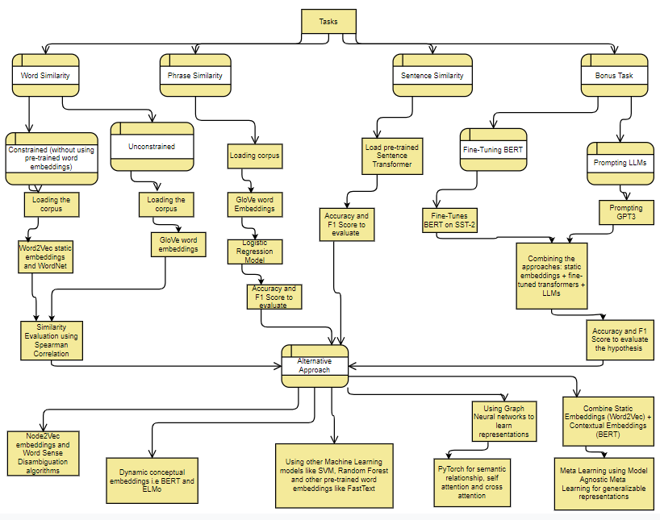

# Representation of Words, Phrases, and Sentences
Submission for Precog Recruitment Task-1:  Representation of Words, Phrases, and Sentences
This repository contains implementations for the following tasks:

1. **Word Similarity**
2. **Phrase and Sentence Similarity**
3. **Bonus Task**

The tasks were implemented on Google Colab.
A complete data flow diagram of the approach is depicted in the image:


## Required Libraries

To run the code, you need to install the following libraries. You can install them using the provided commands:

```bash
!pip install nltk
!pip install gensim
!pip install numpy
!pip install scikit-learn
!pip install scipy
!pip install networkx
!pip install node2vec
!pip install torch
!pip install torch-geometric
!pip install torch-scatter
!pip install torch-sparse
!pip install torch-cluster
!pip install torch-spline-conv
!pip install sentence-transformers
!pip install transformers
!pip install datasets
!pip install openai
```
## Word Similarity Task
To view the word similarity task [Click here](./WordSimilarity)
## Phrase and Sentence Similarity Task
To view the phrase and sentence similarity task [Click here](./Phrase&SentenceSimilarity)
## Bonus Task
To view the bonus task [Click here](./BonusTask)
## Paper Reading Task
The paper reading task report is [here](./PaperReadingReport)
## Programming Task
The programming report is [here](./ProgrammingReport)
